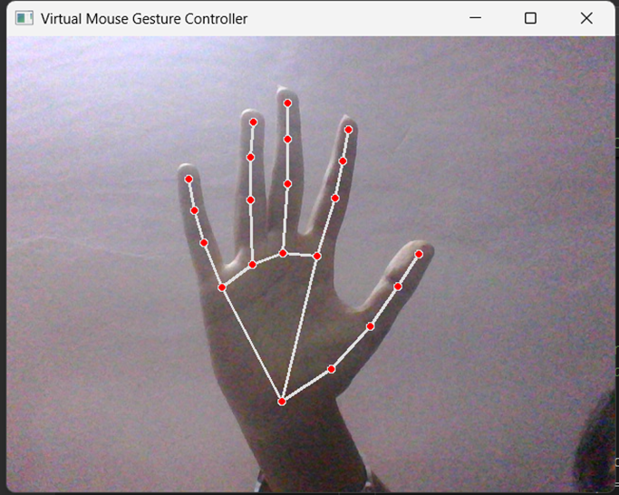
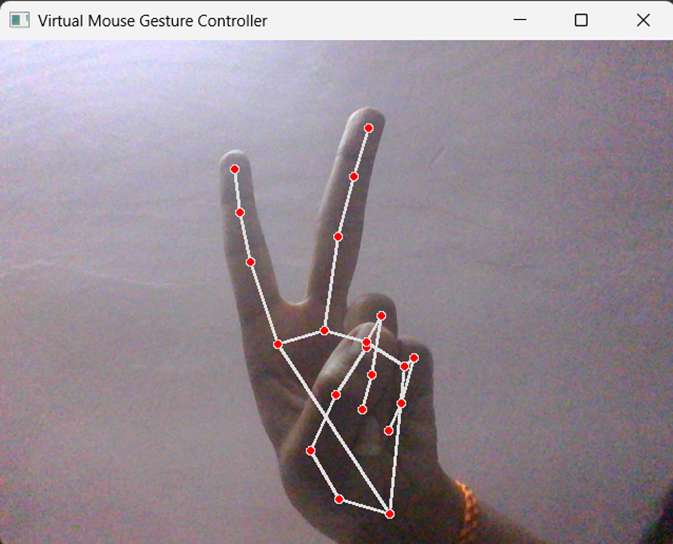
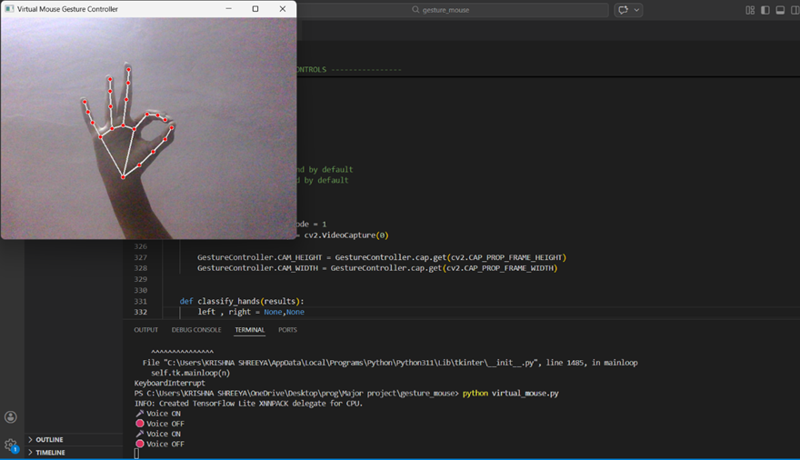

# 🖱️ Gesture Triggered Virtual Mouse

## 📌 Overview

This project implements a **gesture-controlled virtual mouse system** that allows users to interact with a computer without using a physical mouse.
It uses **computer vision and hand gesture recognition** to perform real-time mouse operations.

Additionally, the system includes a unique feature where a **specific hand gesture (thumb and index finger touch)** triggers **voice recognition**, enabling speech-to-text functionality.

---

## 🚀 Features

### 🖱️ Mouse Control using Gestures

* Cursor movement using hand tracking
* Left click
* Right click
* Drag and drop functionality

### 🎤 Gesture-Based Voice Activation (Unique Feature)

* Detects **thumb + index finger touch gesture**
* Activates microphone automatically
* Converts speech into text
* Displays output in terminal

---

## 🛠️ Technologies Used

* Python
* OpenCV
* MediaPipe
* PyAutoGUI
* SpeechRecognition
* NumPy

---

## ⚙️ Installation & Setup

### 1. Clone the Repository

```bash
git clone https://github.com/Shreeya2004-sudo/gesture-triggered-virtual-mouse.git
cd gesture-triggered-virtual-mouse
```

### 2. Install Dependencies

```bash
pip install -r requirements.txt
```

### 3. Run the Project

```bash
python app.py
```

---

## 📷 Demo

<p align="center">
  
  
  
</p>
---

## 🧠 How It Works

* Hand landmarks are detected using **MediaPipe**
* Gestures are recognized based on finger positions and distances
* Mouse actions are executed using **PyAutoGUI**
* When thumb and index finger touch:

  * Voice recognition is activated
  * Speech is captured using microphone
  * Output is displayed as text in terminal

---

## 🎯 Applications

* Touchless human-computer interaction
* Accessibility for physically challenged users
* Smart systems and automation
* Gesture-based control systems


